# EchoShield
## Introduction

This project aims to develop a reinforcement learning-based filter that confuses ASR models, like OpenAI’s Whisper, while remaining intelligible to humans. We will compare its effectiveness across multiple ASR systems and explore both static (e.g., band-pass filters) and dynamic (e.g., RL-based) defense mechanisms against such adversarial attacks. 

TODO: Add image that helps to understand the project.
This could be an architectural diagram or a screenshot of the application.

## Architecture Overview (optional)

TODO: Add simple diagram that explains the architecture.
CNC Strucutre

```mermaid
architecture-beta
    service audio(database)[audio]
    service model(abc)[RL Model] 
    service asr_normal(internet)[ASR] 
    service asr_attack(internet)[ASRwhisper]
    service text_normal(abc)[TextNormal]
    service text_attack(abc)[TextGarbeld]
    service eval(abc)[Evaluate]
  
    junction a_m
    audio:B -- T:a_m
    a_m:R --> L:model
    model:R --> L:asr_attack
    asr_attack:R --> L:text_attack

    junction a_a
    audio:T -- B:a_a
    a_a:R --> L:asr_normal
    asr_normal:R --> L:text_normal
    junction extend_a_a
    text_normal:R -- L:extend_a_a

    junction text
    extend_a_a:B -- T:text
    text_attack:T -- B:text

    text:L --> R:eval
    eval:L --> T:model
```

The evaluation model will be using three metrics. 
- Word Error Rate
- Minimal Change
- Text Similarit

## How to Use

### Prerequisites

TODO: Explain which steps and dependencies are required to run and build the project (e.g., pip install -r requirements.txt)

### Build

TODO: Explain how the whole project can be build.

### Test

TODO: Explain how unit- or integreation tests can be executed.

### Run

TODO: Explain how to run the project (client, server etc.).

## Authors
- [Uplink036](https://github.com/Uplink036)
- [Adam Mützell](https://github.com/AdamMutzell)

## License

Copyright © 2023 Uplink036 
This work is licensed under [MIT]

